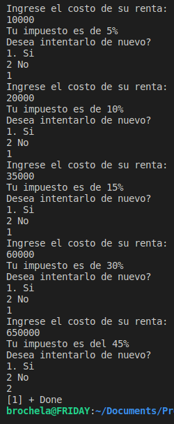
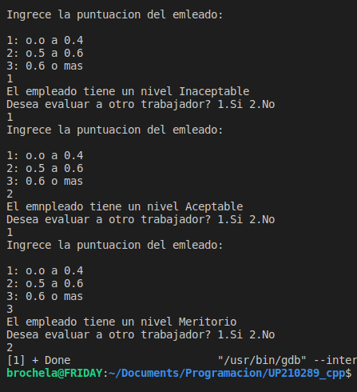
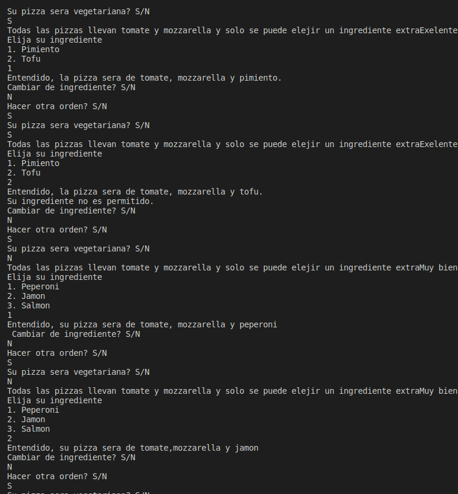
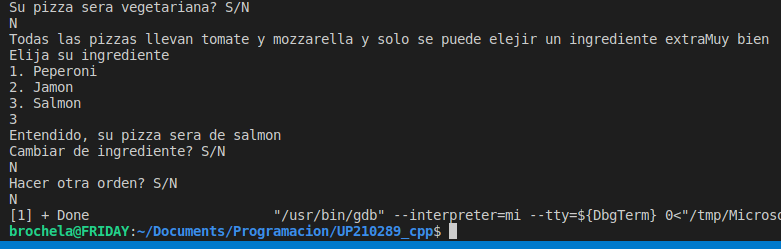
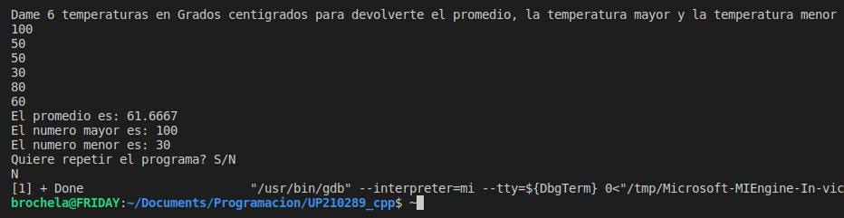
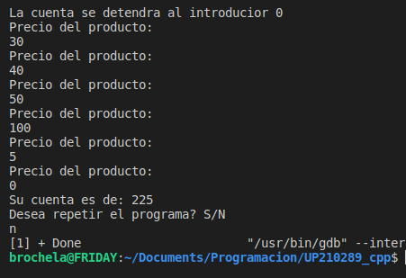
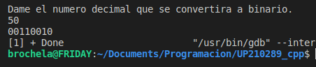

# **Luis Antonio Leon Pedroza**  
## **Unidad 2**
---
# UP210289_cpp
>Estudiante de la Universidad Politecnica de Aguascalientes  
> Ingenieria en Sistemas Computacionales 
---

---

Durante la segunda unidad comenzamos a revisar diferentes comandos en este lenguaje.

## 01_  [Rentas](https://github.com/up210289/UP210289_cpp/blob/main/U2/01_renta.cpp) (Codigo)

<h2>Resultado</h2>

## 02_[Nivel_Empleado](https://github.com/up210289/UP210289_cpp/blob/main/U2/02_Nivel_empleado.cpp)(Codigo)

<h2>Resultado</h2>

## 03_[SalaJuegosNiños](https://github.com/up210289/UP210289_cpp/blob/main/U2/03_SalaJuegosNinos.cpp)(Codigo)

<h2>Resultado</h2>

## 04_[Pizza](https://github.com/up210289/UP210289_cpp/blob/main/U2/04_Pizza.cpp)(Codigo)

<h2>Resultado</h2>

## 05_[Temperaturas](https://github.com/up210289/UP210289_cpp/blob/main/U2/05_temperaturas.cpp)(Codigo)

<h2>Resultado</h2>

## 06_[Despensa](https://github.com/up210289/UP210289_cpp/blob/main/U2/06_Despensa.cpp)(Codigo)

<h2>Resultado</h2>

## 08_[Decimal_a_Binario](https://github.com/up210289/UP210289_cpp/blob/main/U2/08_Decimal_Binario.cpp)(Click en titulo para ver el codigo)

<h2>Resultado</h2>

