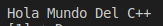
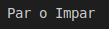
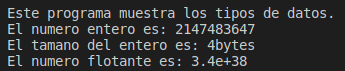
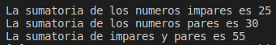
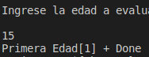
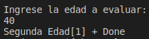
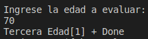
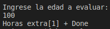

<center>

# **Luis Antonio Leon Pedroza**  
# UP210289_cpp
>Estudiante de la Universidad Politecnica de Aguascalientes  
> Ingenieria en Sistemas Computacionales 
---

</center>

Durante la primer unidad comenzamos los primeros pasos en el mundo de la programacion

## Primer programa de la materia

## 01_Hello World

## **Body**

```
#include<iostream>
using namespace std;
 
 int main(){
    cout <<"Hola Mundo Del C++"<<endl;

    return 0;
 }
 ```
 ## Resultado

<center>



</center>

---

## 02_Par Impar

## **Body**

```
#include <iostream>
using namespace std;

int main()
{
    cout << "Par o Impar" << endl<<"\n" <<endl;
    return 0;
}
```
## **Resultado**

<center>



</center>

## 03_Tipos de datos

## **Body**
```
/*
    unidad 1. Tipos de datos 
    Autor: Luis Antonio Leon Pedroza 
    Fecha: 15/09/22
    Descripcion: Muestra los diferentes tipos de datos en c++
*/
//Libreria para manejo de entradas y salidas de pantalla 
#include<iostream>
//Libreria para el uso de printf y scanf
#include <stdio.h>

//Uso del namespace para evitar el std::
using namespace std;

//Funcion principal de tipo entero
int main()
{
    //Mas informacion en:
    //https://www.geeksforgeenks.otg/c-data-types/
    int entero=2147483647;
    float flotante=3.4e38;
    double grande=2.565465654654;
    char caracter= 'A';

    cout <<"Este programa muestra los tipos de datos. \n";
    cout << "El numero entero es: " << entero << endl;
    cout << "El tamano del entero es: " << sizeof(entero) << "bytes" << endl;
    cout << "El numero flotante es: " << flotante <<endl;

    return 0;
}
```  
## **Resultado**
<center>



</center>

## 04_Ciclos
## **Body**
```
#include <iostream>
using namespace std;
int main()
{
    int n = 10;
    int s1 = 0;
    int s2 = 0;
    int total=0;
    for (int i = 1; i <= n; i++)
    {
        if (i % 2 == 0)
        {
            
            s1 = s1 + i;
        }
        else 
        {
            s2 = s2 + i;
        }
        
    }
    printf("La sumatoria de los numeros impares es %d \n", s2);
    printf("La sumatoria de los numeros pares es %d \n", s1);
    total = s1 + s2;
    printf("La sumatoria de impares y pares es %d \n", total);
    return 0;
}
```
## **Resultado**
<center>



</center>

## 05_Edades
## **Body**
```
#include <iostream>
using namespace std;

int main()
{
    int edad;
    cout << "Ingrese la edad a evaluar: " << endl;
    cin >> edad;
    if (edad >= 1 && edad <= 150)
    {
        if (edad > 0 && edad < 31){
            printf("Primera Edad");
        }else if (edad > 30 && edad < 61 ){
            printf("Segunda Edad");
        }else if (edad > 60 && edad < 91){
            printf("Tercera Edad");
        }else if (edad > 90 && edad < 151){
            printf("Horas extra");
        }
        
        
    }
    else
    {
        printf("La edad es invalida");
    }
    

    return 0;
```
<center>

## ***Resultado 1***



## ***Resultado 2***



## ***Resultado 3***



## ***Resultado 4***



</center>
