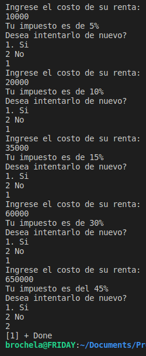
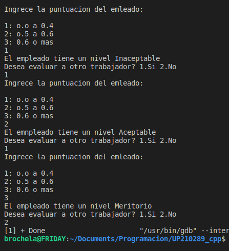
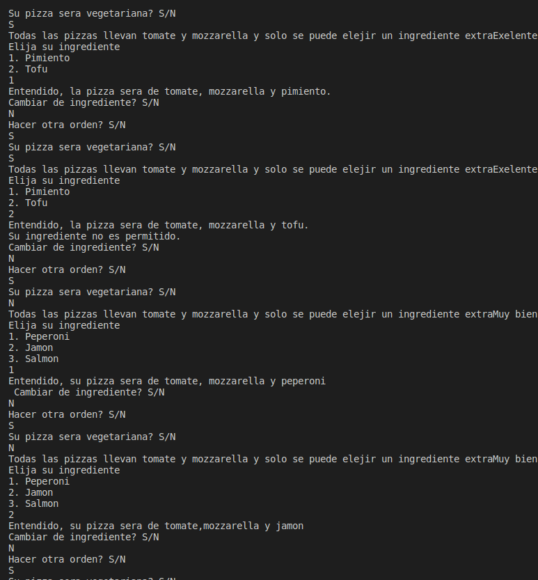
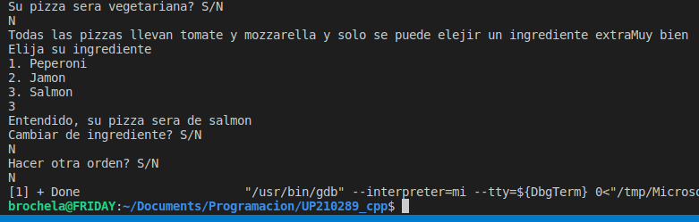
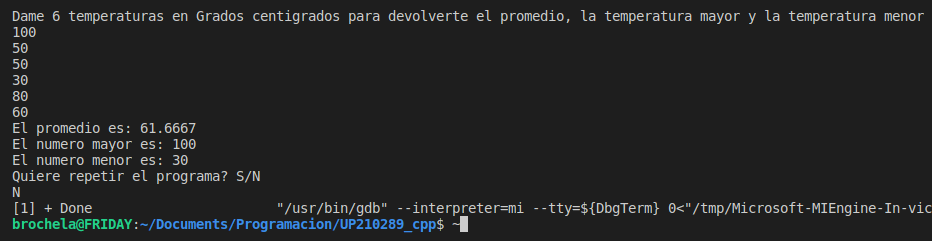
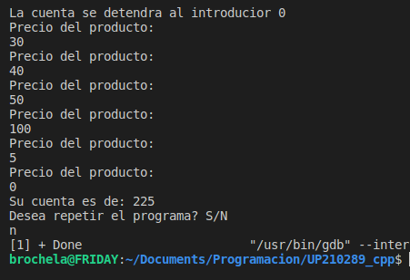
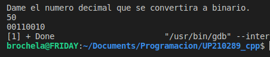

# **Luis Antonio Leon Pedroza**  
## **Unity 3**
---
# UP210289_cpp
> Student of the Universidad Politecnica de Aguascalientes  
> Coputer Ingeniering
---

---

During the third unit we begin to learn about functions and procedures, apart from libraries and we begin to develop our own even more.

## 01_  [Ecuacion](https://github.com/up210289/UP210289_cpp/blob/main/U3/01_Ecuacion.cpp) (Codigo)

<h2>Result</h2>

## 02_[Nivel_Empleado](https://github.com/up210289/UP210289_cpp/blob/main/U2/02_Nivel_empleado.cpp)(Codigo)

<h2>Result</h2>

## 03_[SalaJuegosNiños](https://github.com/up210289/UP210289_cpp/blob/main/U2/03_SalaJuegosNinos.cpp)(Codigo)

<h2>Resultado</h2>

## 04_[Pizza](https://github.com/up210289/UP210289_cpp/blob/main/U2/04_Pizza.cpp)(Codigo)

<h2>Resultado</h2>

## 05_[Temperaturas](https://github.com/up210289/UP210289_cpp/blob/main/U2/05_temperaturas.cpp)(Codigo)

<h2>Resultado</h2>

## 06_[Despensa](https://github.com/up210289/UP210289_cpp/blob/main/U2/06_Despensa.cpp)(Codigo)

<h2>Resultado</h2>

## 08_[Decimal_a_Binario](https://github.com/up210289/UP210289_cpp/blob/main/U2/08_Decimal_Binario.cpp)(Click en titulo para ver el codigo)

<h2>Resultado</h2>

