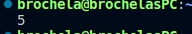
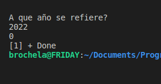
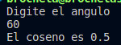
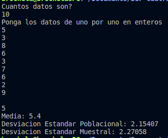
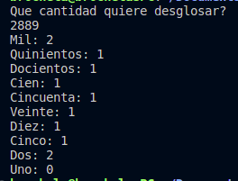
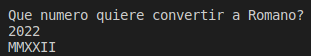
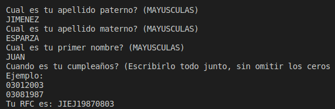
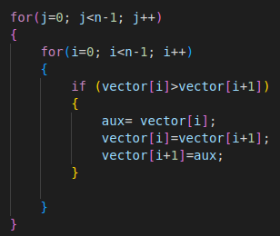
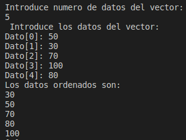
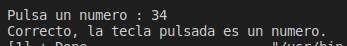

# **Luis Antonio Leon Pedroza**  
## **Unity 3**
---
# UP210289_cpp
> Student of the Universidad Politecnica de Aguascalientes  
> Coputer Ingeniering
---

---

During the third unit we begin to learn about functions and procedures, apart from libraries and we begin to develop our own even more.

## 01_  [Biseccion](https://github.com/up210289/UP210289_cpp/blob/main/U3/01_Biseccion.cpp) (Click in tittle to see the code)

<h2>Result</h2>

## 02_[Año bisiesto](https://github.com/up210289/UP210289_cpp/blob/main/U3/02_A%C3%B1o_Bisisesto.cpp)(Click in tittle to see the code)

<h2>Result</h2>

## 03_[coseno](https://github.com/up210289/UP210289_cpp/blob/main/U3/03_coseno.cpp)(Click in tittle to see the code)

<h2>Result</h2>

## 04_[Desviacion estandar](https://github.com/up210289/UP210289_cpp/blob/main/U3/04_Desviasion_estandar.cpp)(Click in tittle to see the code)

<h2>Resultado</h2>

## 05_[Desgloce de moneda](https://github.com/up210289/UP210289_cpp/blob/main/U3/05_Desglose_de_moneda.cpp)(Click in tittle to see the code)

<h2>Resultado</h2>

## 06_[Entero a Romano](https://github.com/up210289/UP210289_cpp/blob/main/U3/06_Entero_a_Romano.cpp)(Click in tittle to see the code)

<h2>Resultado</h2>

## 07_[RFC](https://github.com/up210289/UP210289_cpp/blob/main/U3/07_RFC.cpp)(Click in tittle to see the code)

<h2>Resultado</h2>

## 08_[Vector ordenado](https://github.com/up210289/UP210289_cpp/blob/main/U3/08_VECTOR_ORDENADO.cpp)(Click in tittle to see the code)

<h2>Resultado</h2>

## 09_[Recursiva](https://github.com/up210289/UP210289_cpp/blob/main/U3/09_Recursiva.cpp)(Click in tittle to see the code)

<h2>Resultado</h2>

